<p align="center">
  <a href="https://sriramdama.in"></a>&nbsp;
  <a href="https://linkedin.com/in/dama-sriram"></a>&nbsp;
  <a href="mailto:sriramdama417@gmail.com"></a>&nbsp;
  <a href="https://www.codechef.com/users/sriram2272"></a>
</p>

```console
$ whoami
> AI systems engineer. I build retrieval pipelines, autonomous agents,
> and the backend infrastructure that keeps them fast at production scale.

$ status --current
> Focused on RAG evaluation & agentic browser automation · CSE undergrad
```


## `▸` Selected Work

#### GHOSTCUT — Forensic Claim Verification
<sub>**2ND PLACE · IIT ROORKEE E-SUMMIT 2026** — 550+ teams</sub>

RAG + NLI engine that validates claims against 10,000+ document chunks and returns evidence-backed verdicts with a trust score, served through a real-time React dashboard.

`91% NLI accuracy` · `+38% retrieval quality` · `<200ms latency` · `10K+ chunks`
<sub>Python · LangChain · SBERT · RoBERTa · React · PostgreSQL</sub>

#### Web Navigator — Autonomous Browser Agent
<sub>**SELECTED · T-HUB HYDERABAD INCUBATION** — top 1% of 1,000+ teams</sub>

Agent that executes multi-step workflows across 100+ pages per session; concurrent Playwright pipelines cut execution time from 55 to 7 minutes with LLM + rule-based extraction.

`87% faster execution` · `50K+ records` · `95% extraction accuracy`
<sub>Python · Playwright · LangChain · AsyncIO</sub>

#### Retrieval Integrity Auditor
<sub>**RAG EVALUATION FRAMEWORK**</sub>

Coverage scoring and top-k analysis across 1,000+ queries — surfaces missing evidence (30–45% in audited pipelines) and cuts irrelevant retrieval noise by 28%, with explainable diagnostics.

`1K+ queries audited` · `−28% retrieval noise` · `+60% debug speed`
<sub>Python · FAISS · OpenAI · Streamlit</sub>


## `▸` Stack

```text
languages   ──  Python · TypeScript · C++ · JavaScript
ai / ml     ──  LangChain · SBERT · RoBERTa · FAISS · Pinecone · PyTorch
backend     ──  FastAPI · Flask · Node.js · PostgreSQL · Supabase
infra       ──  Docker · Azure · GitHub Actions · Linux
```


## `▸` Metrics

<p align="center">
  
  
</p>

<p align="center">
  
</p>

<p align="center">
  
</p>

```text
open source  ──  15+ merged PRs in production codebases
algorithms   ──  1,450+ problems · LeetCode / CodeChef
community    ──  Microsoft Learn Student Ambassador · 200+ students mentored
certified    ──  Microsoft AZ-900 / AI-900 / DP-900 · Oracle OCI · Google Cloud
```


<p align="center">
  <sub><code>open to backend / AI engineering internships — summer 2026</code></sub>
</p>
