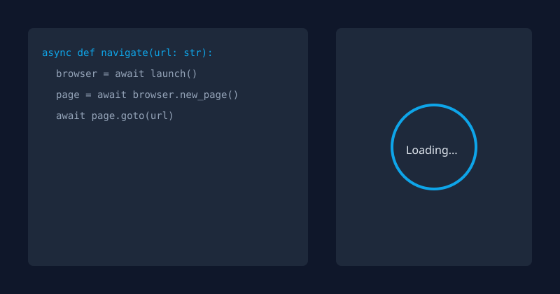

<div align="center">

# 👋 Hi, I'm Dama Sri Ram


### 🎯 AI Engineer | 🤖 Automation Developer | 🧠 AI Agents Builder | 🔐 Cybersecurity Explorer

<p align="center">
  <a href="https://www.linkedin.com/in/dama-sriram/">
    
  </a>
  <a href="mailto:sriramdama417@gmail.com">
    
  </a>
  <a href="https://github.com/Sriram2272">
    
  </a>
</p>

<p align="center">
  
  
  
</p>

</div>

---

<div align="center">

## 💫 About Me

```javascript
const sriram = {
    role: "AI Engineer & Developer",
    pronouns: "He/Him",
    location: "India",
    focus: "Practical AI Systems",
    mission: "Solving Real-World Problems with AI",
    passion: "AGI & Multi-Agent Intelligence",
    currentlyBuilding: [
        "🤖 AI-powered Assistants & AI Agents",
        "⚙️ Automation Frameworks",
        "🔐 Cybersecurity Tools",
        "📡 Telegram Bots",
        "🌐 Scalable Web Applications"
    ],
    askMeAbout: ["AI", "Automation", "Web Dev", "Cybersecurity"],
    technologies: {
        ai: ["LangChain", "AI Agents", "NLP"],
        languages: ["Python", "JavaScript", "C++", "Java"],
        frontend: ["React", "Three.js", "HTML", "CSS"],
        backend: ["Node.js", "Python"],
        tools: ["GitHub", "Linux", "Telethon"]
    },
    funFact: "I automate everything... except coffee ☕"
};
```

### 💡 *"Building advanced intelligence that scales human potential"*

</div>

---

<div align="center">

## 🛠️ Tech Stack & Skills

</div>

<p align="center">
  
  
  
  
</p>

<p align="center">
  
  
  
  
</p>

<p align="center">
  
  
  
  
  
</p>

---

<div align="center">

## 🏆 Certifications & Achievements

<p align="center">
  <a href="https://learn.microsoft.com/en-us/certifications/azure-ai-fundamentals/">
    
  </a>
  <a href="https://learn.microsoft.com/en-us/certifications/azure-fundamentals/">
    
  </a>
</p>

<p align="center">
  <a href="https://cloud.google.com/certification">
    
  </a>
  <a href="https://education.oracle.com/oracle-certification-path/pFamily_48">
    
  </a>
</p>

<p align="center">
  
  
  
  
</p>

</div>

---

<div align="center">

## 🎨 Featured Projects

</div>

| 🌐 **Nexus Voyager** | 🚗 **SimuRide** | ☁️ **Weather AI** |
|:---:|:---:|:---:|
|  |  |  |
| **AI-Powered Travel Assistant** | **Ride Simulation Platform** | **Smart Weather Predictor** |
| Advanced navigation & recommendations with intelligent AI agents | Real-time ride simulation engine with dynamic route planning | ML-based forecasting system with predictive analytics |
| [View Project →](#) | [View Project →](#) | [View Project →](#) |

---

<div align="center">

## 📊 GitHub Analytics

</div>

<p align="center">
  
  
</p>

<p align="center">
  
  
</p>

<p align="center">
  
</p>

<p align="center">
  
  
  
</p>

---

<div align="center">

### 🐍 Contribution Activity

<picture>
  <source media="(prefers-color-scheme: dark)" srcset="https://raw.githubusercontent.com/Sriram2272/Sriram2272/output/github-contribution-grid-snake-dark.svg">
  <source media="(prefers-color-scheme: light)" srcset="https://raw.githubusercontent.com/Sriram2272/Sriram2272/output/github-contribution-grid-snake.svg">
  
</picture>

</div>

---

<div align="center">

## 🤝 Let's Collaborate!

I'm always open to collaborating on innovative projects, especially those involving:
- 🤖 **AI & Machine Learning**: Building intelligent systems that solve real-world problems
- 🔧 **Automation**: Creating tools that make developers' lives easier
- 🌐 **Open Source**: Contributing to and building impactful open-source projects
- 💡 **Innovative Ideas**: Exploring new technologies and pushing boundaries

**Want to work together?** Feel free to reach out!

[](https://www.linkedin.com/in/dama-sriram/)
[](mailto:sriramdama417@gmail.com)
[](https://github.com/Sriram2272)

</div>

---

<div align="center">

**💜 Thank you for visiting! Let's build something amazing together! 🚀**


</div>
